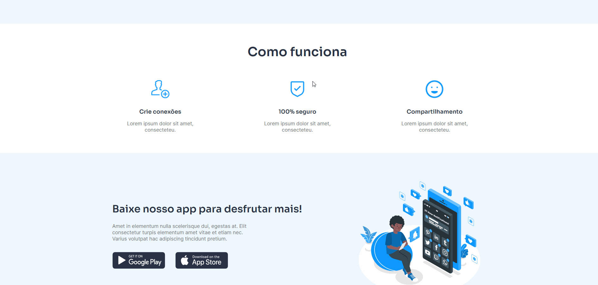

<h1 align="center">
  👨‍💻 Rachi
</h1>

Desafio front-end feito com ReactJS e Typescript. Todo o desenvolvimento foi realizado durante algumas <a href="https://twitch.tv/devlucaslopes" target="_blank">lives na Twitch</a>.

Desafio criado por: <a href="https://www.figma.com/file/Yb9IBH56g7T1hdIyZ3BMNO/Desafios---Codel%C3%A2ndia?node-id=32505%3A4">Iuri Code</a>

